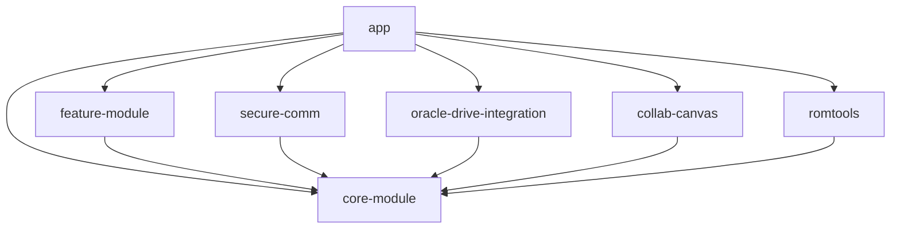

# 📡 API Documentation - AOSP ReGenesis

## 📋 Table of Contents

- [🏗️ Architecture Overview](#️-architecture-overview)
- [🔒 Security API](#-security-api)
- [☁️ Cloud Integration API](#️-cloud-integration-api)
- [🎨 UI Components API](#-ui-components-api)
- [📱 ROM Tools API](#-rom-tools-api)
- [🧠 Core Module API](#-core-module-api)
- [📊 Data Layer API](#-data-layer-api)
- [🔧 Utilities API](#-utilities-api)

## 🏗️ Architecture Overview

### Core Principles

- **Dependency Injection**: All modules use Hilt for DI
- **Repository Pattern**: Data access through repositories
- **Clean Architecture**: Domain, Data, and Presentation layers
- **Reactive Programming**: Kotlin Coroutines and Flow
- **Type Safety**: Sealed classes for state management

### Module Dependencies



## 🔒 Security API

### SecureCommunication

**Package**: `com.aura.memoria.secure.communication`

#### Interface

```kotlin
interface SecureCommunication {
    /**
     * Encrypts and sends a message to the specified recipient.
     */
    suspend fun sendEncryptedMessage(
        message: String,
        recipient: DeviceId
    ): Result<MessageId>
    
    /**
     * Receives and decrypts messages from the specified sender.
     */
    suspend fun receiveEncryptedMessage(
        messageId: MessageId
    ): Result<DecryptedMessage>
    
    /**
     * Establishes a secure channel with another device.
     */
    suspend fun establishSecureChannel(
        deviceId: DeviceId
    ): Result<SecureChannel>
}
```

#### Implementation

```kotlin
@Singleton
class SecureCommunicationImpl @Inject constructor(
    private val cryptoManager: CryptoManager,
    private val keyManager: KeyManager,
    private val networkManager: NetworkManager
) : SecureCommunication {
    
    override suspend fun sendEncryptedMessage(
        message: String,
        recipient: DeviceId
    ): Result<MessageId> = withContext(Dispatchers.IO) {
        try {
            val publicKey = keyManager.getPublicKey(recipient)
            val encryptedMessage = cryptoManager.encrypt(message, publicKey)
            val messageId = networkManager.sendMessage(encryptedMessage, recipient)
            Result.success(messageId)
        } catch (e: Exception) {
            Result.failure(e)
        }
    }
}
```

### CryptoManager

**Package**: `com.aura.memoria.secure.crypto`

```kotlin
interface CryptoManager {
    /**
     * Encrypts data using AES-GCM with the specified key.
     */
    suspend fun encrypt(data: String, key: SecretKey): EncryptedData
    
    /**
     * Decrypts data using AES-GCM with the specified key.
     */
    suspend fun decrypt(encryptedData: EncryptedData, key: SecretKey): String
    
    /**
     * Generates a new AES-256 key in the Android Keystore.
     */
    suspend fun generateKey(alias: String): SecretKey
    
    /**
     * Retrieves an existing key from the Android Keystore.
     */
    suspend fun getKey(alias: String): SecretKey?
}
```

### Data Models

```kotlin
@Parcelize
data class EncryptedData(
    val cipherText: ByteArray,
    val iv: ByteArray,
    val authTag: ByteArray
) : Parcelable

@Parcelize
data class DecryptedMessage(
    val content: String,
    val sender: DeviceId,
    val timestamp: Instant,
    val signature: ByteArray
) : Parcelable

@JvmInline
value class DeviceId(val value: String)

@JvmInline
value class MessageId(val value: String)
```

## ☁️ Cloud Integration API

### OracleCloudService

**Package**: `com.aura.memoria.cloud.oracle`

```kotlin
interface OracleCloudService {
    /**
     * Uploads data to Oracle Cloud Storage.
     */
    suspend fun uploadData(
        data: ByteArray,
        path: String,
        metadata: Map<String, String> = emptyMap()
    ): Result<CloudObjectId>
    
    /**
     * Downloads data from Oracle Cloud Storage.
     */
    suspend fun downloadData(objectId: CloudObjectId): Result<ByteArray>
    
    /**
     * Synchronizes local data with cloud storage.
     */
    suspend fun synchronizeData(): Result<SyncReport>
    
    /**
     * Lists objects in the specified cloud directory.
     */
    suspend fun listObjects(
        path: String,
        recursive: Boolean = false
    ): Result<List<CloudObject>>
}
```

### CloudSyncManager

```kotlin
@Singleton
class CloudSyncManager @Inject constructor(
    private val oracleService: OracleCloudService,
    private val localRepository: LocalDataRepository,
    private val conflictResolver: ConflictResolver
) {
    
    /**
     * Performs bidirectional sync between local and cloud data.
     */
    suspend fun performSync(): Result<SyncReport> = withContext(Dispatchers.IO) {
        val localChanges = localRepository.getChangedItems()
        val cloudChanges = oracleService.getChangedItems()
        
        val conflicts = detectConflicts(localChanges, cloudChanges)
        val resolvedConflicts = conflictResolver.resolve(conflicts)
        
        applyChanges(localChanges, cloudChanges, resolvedConflicts)
    }
}
```

## 🎨 UI Components API

### ComposeComponents

**Package**: `com.aura.memoria.ui.components`

#### AuraButton

```kotlin
@Composable
fun AuraButton(
    text: String,
    onClick: () -> Unit,
    modifier: Modifier = Modifier,
    style: AuraButtonStyle = AuraButtonStyle.Primary,
    enabled: Boolean = true,
    loading: Boolean = false
) {
    Button(
        onClick = onClick,
        modifier = modifier,
        enabled = enabled && !loading,
        colors = ButtonDefaults.buttonColors(
            containerColor = style.backgroundColor,
            contentColor = style.contentColor
        )
    ) {
        if (loading) {
            CircularProgressIndicator(
                modifier = Modifier.size(16.dp),
                color = style.contentColor
            )
        } else {
            Text(text = text)
        }
    }
}

sealed class AuraButtonStyle(
    val backgroundColor: Color,
    val contentColor: Color
) {
    object Primary : AuraButtonStyle(
        backgroundColor = Color(0xFF6366F1),
        contentColor = Color.White
    )
    
    object Secondary : AuraButtonStyle(
        backgroundColor = Color(0xFFF3F4F6),
        contentColor = Color(0xFF374151)
    )
    
    object Danger : AuraButtonStyle(
        backgroundColor = Color(0xFFEF4444),
        contentColor = Color.White
    )
}
```

#### AuraCard

```kotlin
@Composable
fun AuraCard(
    modifier: Modifier = Modifier,
    elevation: Dp = 4.dp,
    onClick: (() -> Unit)? = null,
    content: @Composable ColumnScope.() -> Unit
) {
    Card(
        modifier = modifier.then(
            if (onClick != null) {
                Modifier.clickable { onClick() }
            } else Modifier
        ),
        elevation = CardDefaults.cardElevation(defaultElevation = elevation),
        content = {
            Column(
                modifier = Modifier.padding(16.dp),
                content = content
            )
        }
    )
}
```

### Theme System

```kotlin
@Composable
fun AuraTheme(
    darkTheme: Boolean = isSystemInDarkTheme(),
    content: @Composable () -> Unit
) {
    val colorScheme = if (darkTheme) {
        DarkColorScheme
    } else {
        LightColorScheme
    }
    
    MaterialTheme(
        colorScheme = colorScheme,
        typography = AuraTypography,
        content = content
    )
}

val AuraTypography = Typography(
    displayLarge = TextStyle(
        fontFamily = FontFamily.Default,
        fontWeight = FontWeight.Normal,
        fontSize = 57.sp,
        lineHeight = 64.sp
    ),
    // ... other text styles
)
```

## 📱 ROM Tools API

### RomManager

**Package**: `com.aura.memoria.romtools.manager`

```kotlin
interface RomManager {
    /**
     * Flashes a custom ROM to the device.
     */
    suspend fun flashRom(
        romFile: File,
        progressCallback: (Float) -> Unit = {}
    ): Result<FlashResult>
    
    /**
     * Creates a NANDroid backup of the current system.
     */
    suspend fun createBackup(
        backupName: String,
        includeData: Boolean = true,
        progressCallback: (Float) -> Unit = {}
    ): Result<BackupInfo>
    
    /**
     * Restores a NANDroid backup.
     */
    suspend fun restoreBackup(
        backupInfo: BackupInfo,
        progressCallback: (Float) -> Unit = {}
    ): Result<RestoreResult>
    
    /**
     * Unlocks the device bootloader.
     */
    suspend fun unlockBootloader(): Result<UnlockResult>
    
    /**
     * Installs a custom recovery.
     */
    suspend fun installRecovery(
        recoveryFile: File
    ): Result<InstallResult>
}
```

### Safety and Verification

```kotlin
interface RomVerifier {
    /**
     * Verifies the cryptographic signature of a ROM file.
     */
    suspend fun verifyRomSignature(romFile: File): Result<VerificationResult>
    
    /**
     * Checks if the ROM is compatible with the current device.
     */
    suspend fun checkCompatibility(romFile: File): Result<CompatibilityReport>
    
    /**
     * Validates the integrity of a ROM file.
     */
    suspend fun validateIntegrity(romFile: File): Result<IntegrityReport>
}

sealed class VerificationResult {
    object Valid : VerificationResult()
    data class Invalid(val reason: String) : VerificationResult()
    data class Unknown(val message: String) : VerificationResult()
}
```

## 🧠 Core Module API

### Repository Pattern

```kotlin
interface Repository<T, ID> {
    suspend fun findById(id: ID): T?
    suspend fun findAll(): List<T>
    suspend fun save(entity: T): T
    suspend fun delete(id: ID): Boolean
    suspend fun exists(id: ID): Boolean
}

@Singleton
class UserRepository @Inject constructor(
    private val userDao: UserDao,
    private val networkService: NetworkService
) : Repository<User, UserId> {
    
    override suspend fun findById(id: UserId): User? {
        return userDao.findById(id.value) ?: run {
            val networkUser = networkService.getUser(id)
            networkUser?.let { userDao.insert(it) }
            networkUser
        }
    }
    
    // ... other implementations
}
```

### State Management

```kotlin
sealed class UiState<out T> {
    object Loading : UiState<Nothing>()
    data class Success<T>(val data: T) : UiState<T>()
    data class Error(val exception: Throwable) : UiState<Nothing>()
}

sealed class NetworkResult<out T> {
    data class Success<T>(val data: T) : NetworkResult<T>()
    data class Error(val code: Int, val message: String) : NetworkResult<Nothing>()
    object NetworkError : NetworkResult<Nothing>()
    object Loading : NetworkResult<Nothing>()
}
```

## 📊 Data Layer API

### Database (Room)

```kotlin
@Entity(tableName = "users")
data class UserEntity(
    @PrimaryKey val id: String,
    val name: String,
    val email: String,
    val createdAt: Long,
    val updatedAt: Long
)

@Dao
interface UserDao {
    @Query("SELECT * FROM users WHERE id = :id")
    suspend fun findById(id: String): UserEntity?
    
    @Query("SELECT * FROM users")
    suspend fun findAll(): List<UserEntity>
    
    @Insert(onConflict = OnConflictStrategy.REPLACE)
    suspend fun insert(user: UserEntity)
    
    @Delete
    suspend fun delete(user: UserEntity)
    
    @Query("DELETE FROM users WHERE id = :id")
    suspend fun deleteById(id: String)
}

@Database(
    entities = [UserEntity::class],
    version = 1,
    exportSchema = false
)
@TypeConverters(Converters::class)
abstract class AuraDatabase : RoomDatabase() {
    abstract fun userDao(): UserDao
}
```

### Network Layer

```kotlin
interface ApiService {
    @GET("users/{id}")
    suspend fun getUser(@Path("id") id: String): Response<UserDto>
    
    @POST("users")
    suspend fun createUser(@Body user: CreateUserDto): Response<UserDto>
    
    @PUT("users/{id}")
    suspend fun updateUser(
        @Path("id") id: String,
        @Body user: UpdateUserDto
    ): Response<UserDto>
    
    @DELETE("users/{id}")
    suspend fun deleteUser(@Path("id") id: String): Response<Unit>
}

@Singleton
class NetworkManager @Inject constructor(
    private val apiService: ApiService,
    private val errorHandler: NetworkErrorHandler
) {
    
    suspend fun <T> safeApiCall(
        apiCall: suspend () -> Response<T>
    ): NetworkResult<T> = withContext(Dispatchers.IO) {
        try {
            val response = apiCall()
            if (response.isSuccessful) {
                NetworkResult.Success(response.body()!!)
            } else {
                NetworkResult.Error(response.code(), response.message())
            }
        } catch (e: IOException) {
            NetworkResult.NetworkError
        } catch (e: Exception) {
            errorHandler.handleError(e)
        }
    }
}
```

## 🔧 Utilities API

### Extensions

```kotlin
// String extensions
fun String.isValidEmail(): Boolean {
    return android.util.Patterns.EMAIL_ADDRESS.matcher(this).matches()
}

fun String.toDeviceId(): DeviceId = DeviceId(this)

// Context extensions
fun Context.showToast(message: String, duration: Int = Toast.LENGTH_SHORT) {
    Toast.makeText(this, message, duration).show()
}

// Flow extensions
fun <T> Flow<T>.throttleLatest(periodMillis: Long): Flow<T> {
    return this
        .conflate()
        .transform { value ->
            emit(value)
            delay(periodMillis)
        }
}

// Compose extensions
@Composable
fun <T> Flow<T>.collectAsStateWithLifecycle(
    initialValue: T,
    lifecycle: Lifecycle = LocalLifecycleOwner.current.lifecycle,
    minActiveState: Lifecycle.State = Lifecycle.State.STARTED
): State<T> {
    return collectAsState(
        initial = initialValue,
        context = lifecycle.coroutineScope.coroutineContext
    )
}
```

### Logging

```kotlin
interface Logger {
    fun d(tag: String, message: String)
    fun i(tag: String, message: String)
    fun w(tag: String, message: String)
    fun e(tag: String, message: String, throwable: Throwable? = null)
}

@Singleton
class TimberLogger @Inject constructor() : Logger {
    override fun d(tag: String, message: String) = Timber.tag(tag).d(message)
    override fun i(tag: String, message: String) = Timber.tag(tag).i(message)
    override fun w(tag: String, message: String) = Timber.tag(tag).w(message)
    override fun e(tag: String, message: String, throwable: Throwable?) = 
        Timber.tag(tag).e(throwable, message)
}

// Usage
class SomeClass @Inject constructor(private val logger: Logger) {
    fun doSomething() {
        logger.d("SomeClass", "Doing something important")
    }
}
```

---

## 🔗 Error Handling

### Common Error Types

```kotlin
sealed class AuraError : Exception() {
    data class NetworkError(override val message: String) : AuraError()
    data class SecurityError(override val message: String) : AuraError()
    data class ValidationError(val field: String, override val message: String) : AuraError()
    data class UnknownError(override val cause: Throwable) : AuraError()
}

class ErrorHandler @Inject constructor(
    private val logger: Logger
) {
    fun handleError(error: Throwable): AuraError {
        logger.e("ErrorHandler", "Handling error: ${error.message}", error)
        
        return when (error) {
            is IOException -> AuraError.NetworkError("Network connection failed")
            is SecurityException -> AuraError.SecurityError("Security validation failed")
            is IllegalArgumentException -> AuraError.ValidationError("", error.message ?: "")
            else -> AuraError.UnknownError(error)
        }
    }
}
```

---

## 📝 Usage Examples

### Sending Encrypted Message

```kotlin
class MessageViewModel @Inject constructor(
    private val secureCommunication: SecureCommunication
) : ViewModel() {
    
    fun sendMessage(content: String, recipientId: String) {
        viewModelScope.launch {
            val result = secureCommunication.sendEncryptedMessage(
                message = content,
                recipient = DeviceId(recipientId)
            )
            
            when (result.isSuccess) {
                true -> _messageState.value = UiState.Success("Message sent")
                false -> _messageState.value = UiState.Error(result.exceptionOrNull()!!)
            }
        }
    }
}
```

### Using UI Components

```kotlin
@Composable
fun LoginScreen() {
    var email by remember { mutableStateOf("") }
    var password by remember { mutableStateOf("") }
    
    AuraCard {
        OutlinedTextField(
            value = email,
            onValueChange = { email = it },
            label = { Text("Email") }
        )
        
        OutlinedTextField(
            value = password,
            onValueChange = { password = it },
            label = { Text("Password") },
            visualTransformation = PasswordVisualTransformation()
        )
        
        AuraButton(
            text = "Login",
            onClick = { /* handle login */ },
            style = AuraButtonStyle.Primary
        )
    }
}
```

---

**This API documentation provides comprehensive coverage of all major components in the AOSP
ReGenesis project. Each API is designed with type safety, testability, and maintainability in mind.
**